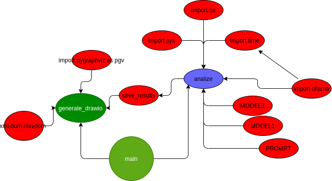

This Python program is designed to analyze Python code or text files, convert their structure into a DOT format suitable for visualization with Graphviz, and then generate a corresponding DRAWIO file for further editing or visualization. It uses two AI models (`ollama` and `mistral`) to perform the analysis based on prompts. Here's a step-by-step explanation of how it works:

### Import Statements
- Imports necessary modules such as `os`, `sys`, `time`, `ollama`, `pygraphviz` as `pgv`, and `xml.dom.minidom`.

### Constants and Lists
- Defines constants for the names of the AI models (`MODEL1` and `MODEL2`) and a list containing both.
- Sets a constant `PROMPT` which contains the instruction for the AI models.

### Functions
#### `analyze`
- Takes input data (Python code or text), an optional model name, and an optional prompt.
- Sends the data along with the prompt to one of the AI models (`ollama` or `mistral`) for analysis.
- Returns the content of the response from the AI model.

#### `save_results`
- Saves the generated DOT format text to a file. The filename includes the base name of the original file, the current timestamp, and the model name used for analysis.

#### `generate_drawio`
- Converts the DOT format text into a format compatible with DRAWIO (an XML-based format).
- Creates a new XML document and populates it with nodes and edges representing the analyzed code structure.
- Saves the resulting XML document to a `.drawio` file.

#### `main`
- Checks if a filename was provided as a command-line argument. If not, it prints an error message and exits.
- Validates the file extension to ensure it's either `.txt` or `.py`.
- Reads the contents of the specified file.
- Iterates over the list of AI models, performing the following steps for each:
  - Prints the model being used.
  - Measures and prints the time taken for the analysis.
  - Calls the `analyze` function with the file contents and saves the result.
  - Generates a DRAWIO file from the DOT format text.

### Execution Flow
- When run directly (not imported as a module), the `main` function is executed.
- This function processes the command-line arguments, validates the input file, reads its contents, analyzes it using one of the AI models, generates DOT and DRAWIO files, and prints relevant information about the process.

Overall, this program automates the process of analyzing Python code or text files, visualizing their structure using AI-driven analysis, and exporting the results in formats suitable for further processing or visualization.